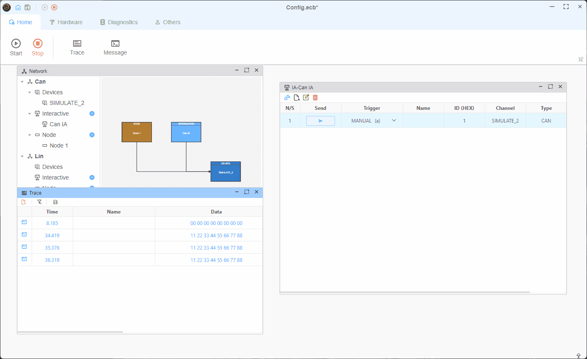

  

  <h1>EcuBus-Pro</h1>

   

    
    
    
  

  <b style="font-size:16px">A powerful automotive ECU development tool</b> 
  <i>Easy of use, Cross platform, Multi dongle, Powerful script ability, CLI support</i> 
  Document: <a href="https://app.whyengineer.com">https://app.whyengineer.com</a>

## Overview

EcuBus-Pro is an open-source alternative to commercial automotive diagnostic tools like `CAN-OE`. It provides a comprehensive solution for ECU development and testing with:

* 🆓 Open-source and free to use
* 🚀 Modern, intuitive user interface
* 💻 Cross-platform support (Windows, Linux)
* 🔌 Extensive hardware compatibility (PEAK, Kvaser, ZLG, and more)
* 📝 Powerful TypeScript-based scripting engine
* ⌨️ Full-featured command-line interface

### Core Features

For detailed information, please refer to our [User Manual](./docs/um/concept.md).

#### Hardware Support

| Manufacturer | Supported Protocols |
|--------|-------------------|
| PEAK | CAN, CAN-FD, LIN |
| KVASER | CAN, CAN-FD |
| ZLG | CAN, CAN-FD |
| Toomoss | CAN, CAN-FD |

#### Software Capabilities

| Feature | Description |
|---------|-------------|
| Platform Support | Windows (installer, portable), Linux (deb package) |
| Diagnostic Protocols | CAN/CAN-FD, DoIP, LIN |
| Scripting | Advanced TypeScript-based automation - [Documentation](./docs/um/script.md) |
| Database Support | LIN LDF (edit & export), CAN DBC (view) - [Details](./docs/um/database.md) |
| Data Visualization | Real-time signal graphing and analysis |

### Feature Highlights

#### CAN Communication

#### UDS Diagnostics

#### Signal Analysis

### Scripting Engine
Built on Node.js, our scripting engine enables:
- Full access to Node.js ecosystem
- Comprehensive EcuBus-Pro API integration
- Advanced test automation capabilities

### Command Line Interface
Streamline your workflow with powerful CLI support:

## Support & Sponsorship

Consider [becoming a sponsor](./docs/about/sponsor) to support ongoing development. Sponsors receive prominent logo placement with website links. 🙏

### Professional Support

We offer premium technical support for sponsors, including access to the private [ecubus/technical-support](https://github.com/ecubus/technical-support) repository with these benefits:

- [X] Priority issue resolution
- [X] One-on-one technical consultation
- [X] Custom development support for Security Access (0x27) and Authentication (0x29)

## Contributors

Thanks to all the contributors who have helped shape EcuBus-Pro:

We welcome contributions! Please review our [contribution guidelines](./.github/contributing.md) before getting started.

## License
Apache-2.0

---

