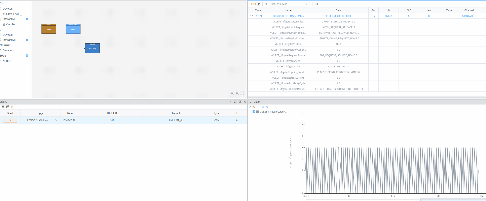

# FAQ

#### How to configure UDS message length to 8 bytes?
::: details Answer
You can enable padding by going to UDS Tester -> Tp Base -> Padding Enable. You can also set your own Padding Value, which defaults to 0x00.

:::

#### ZLG 打开设备提示 Set baud rate failed? 
::: details Answer
这是一个已知问题，请将EcuBus-Pro安装在非C盘的其他磁盘分区上即可解决。
:::

#### When using a sequencer to send UDS services over LIN with ID 0x3C and NAD 0x55, why not send a LIN message with ID 0x3D afterward for the slave to respond?
::: details Answer
This is due to the implementation of the lin schedule table. You should start any schedule table first.

Then you can send the LIN message with ID 0x3D.

:::

#### How to calculate the CRC value of a message?
::: details Answer
You can calculate CRC values using the built-in [CRC](https://app.whyengineer.com/scriptApi/classes/CRC.html) API in scripts. The API supports various CRC algorithms including CRC8, CRC16, and CRC32 with configurable parameters.

:::

#### How to implement loop counting for periodic messages?
::: details Answer

**If you has database and want update signal value periodically:**
1. First you need config the message as periodic.
2. Then you neen use [OnCan](https://app.whyengineer.com/scriptApi/classes/UtilClass.html#oncan) API to listen the message send/receive.
3. Use [setSignal](https://app.whyengineer.com/scriptApi/functions/setSignal.html) API to update signal value.

```ts
import { setSignal } from 'ECB'
let val = 0

Util.OnCan(0x142, (data) => {
   setSignal('Model3CAN.VCLEFT_liftgateLatchRequest', val++ % 5)
})
```



**Without database:**
1. Just use [output](https://app.whyengineer.com/scriptApi/functions/output.html) API to output the frame with any value you want.

```ts
import { output,CanMessage,CAN_ID_TYPE} from 'ECB'
setInterval(() => {
  const canMsg:CanMessage = {
      id: 0x111,
      data: Buffer.from([0,1,2,3,4,5,6,7]),
      dir: 'OUT',
      msgType:{
        idType: CAN_ID_TYPE.STANDARD,
        remote: false,
        brs: false,
        canfd: false,
      }
    }
   output(canMsg)
}, 1000)
```

:::


# Ask Questions

<script setup>
import Twikoo from '../../component/Twikoo.vue'
</script>

<Twikoo lang="en-US" />