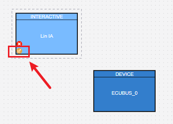
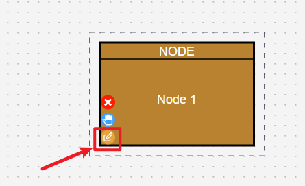
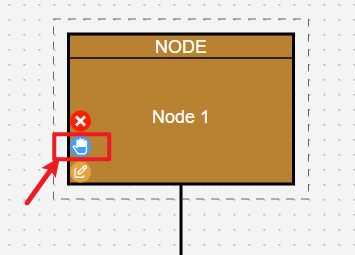
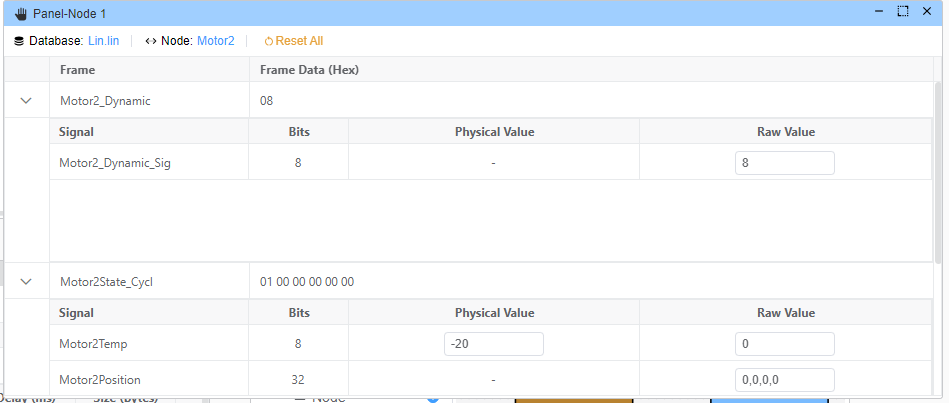

# LIN

LIN is a cost-effective and deterministic communication protocol designed for connecting Electronic Control Units (ECUs) with smart sensors, actuators, and controls. EcuBus-Pro's LIN module provides comprehensive features for developing, analyzing, and testing LIN networks in compliance with LIN 2.x specifications.

## Adding Device

Through the top menu bar, select `Hardware`, then click the `+` button on the right side of devices that support LIN to add a device.

Supported Hardware:
| Manufacturer | Protocols | Abilities |
|--------|-------------------| -- |
| `EcuBus LinCable` | LIN | Supports error injection, can perform conformance testing, and supports PWM output |
| PEAK | LIN | |
| KVASER | LIN | |
| Toomoss | LIN| Support 12v voltage output/input, 5v voltage output   |
| VECTOR | LIN | |

## Configure Device

After clicking add device, you will be required to input device settings:
1. Custom device name
2. Device channel
3. Working mode, Master or Slave
4. Baud rate
5. Bound database (optional)

> [!IMPORTANT]
> Some features described below may require importing a LIN Description File (LDF). For more information about LDF, see the [database documentation](./../ldf).

 

## Schedule Table Management

> [!IMPORTANT]
> Available when LIN is working as a Master node.
> The corresponding device needs to load the corresponding database.

Schedule table management allows periodic execution of a specific schedule table from the LDF database.

### Add LIN Interaction
   - Open the Network interface
   - Click the `+` button under the `Interaction` tab in the `Lin` network on the left side of Network to add an interaction
     

### Open LIN Interaction
  - Open interaction configuration
    
  - Configure the LIN device connected to the interaction
    
  - Select the LIN device you want to connect
    
  - View and manage existing schedule tables. You can temporarily skip a frame in a schedule table by turning off Active.
     

## Node Simulation & Signal Editing

> [!IMPORTANT]
> The corresponding device needs to load the corresponding database.

Configure and simulate LIN nodes to test network behavior and dynamically update signal values for corresponding nodes.

### Node Configuration Steps

1. **Add Node**
   - Open the Network interface
   - Click the `+` button under the `Node` tab on the left side of Network to add a node
     

2. **Configure Node**
   - Open Node configuration
     
   - Set up Node connected device
     
   - Select the network node that the Node simulates (**Need to select the corresponding LIN device, and the corresponding device has a bound database**)
     

3. **Signal Value Editor**
   - After the Node is configured, you can edit the signal values of the configured Node
     
   - Modify signal values (**Only signals published by the configured Node can be modified. For example, in the figure below, only the signal values of `Motor2` as a publisher can be modified**)
     

4. **Node Simulation**
   After the Node is configured with a network node, it will automatically simulate the Node sending signals.
   For example, when the device Lin works in Master mode and Node1 is configured as a `Motor2` Slave network node, when a request for `Motor2` is received, Node1 will automatically respond to this frame and give a Response.

