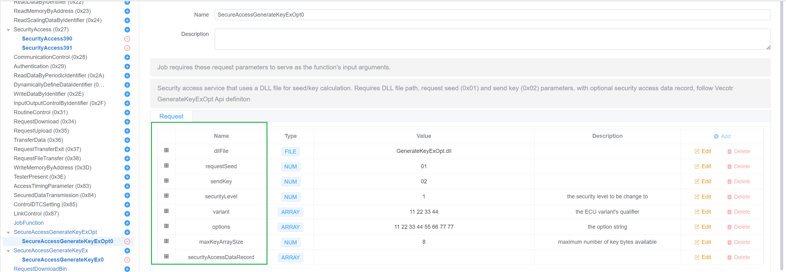

# Build In Script

The Built-In Script system provides pre-configured diagnostic services for common UDS operations. This documentation covers the available built-in scripts and their functionality.

## Supported Built-In Script


### [SecureAccessGenerateKeyEx](https://github.com/ecubus/EcuBus-Pro/tree/master/resources/buildInScript/SecureAccessGenerateKeyEx)

This script is used to generate a key for the security access process. see [GenerateKeyEx](https://cdn.vector.com/cms/content/know-how/_application-notes/AN-IDG-1-017_SecurityAccess.pdf).

```c
VKeyGenResultEx GenerateKeyEx (
  const unsigned char* ipSeedArray,  
  unsigned int iSeedArraySize, 
  const unsigned int iSecurityLevel,  
  const char* ipVariant, 
  unsigned char* iopKeyArray,  
  unsigned int iMaxKeyArraySize, 
  unsigned int& oActualKeyArraySize 
);
```


#### Parameters

- **dllFile**
  - The path to the DLL file, the DLL must be a 64-bit DLL file and contains the GenerateKeyEx function.
```c
VKeyGenResultEx GenerateKeyEx (
  const unsigned char* ipSeedArray,  
  unsigned int iSeedArraySize, 
  const unsigned int iSecurityLevel,  
  const char* ipVariant, 
  unsigned char* iopKeyArray,  
  unsigned int iMaxKeyArraySize, 
  unsigned int& oActualKeyArraySize 
);
```
- **requestSeed**
  - The request seed sub-function, 1,3,5,7,9,11,13,15
  - Default: 0x01

- **sendKey**
  - The send key sub-function, 2,4,6,8,10,12,14,16
  - Default: 0x02

- **securityLevel**
  - The security level to be change to

- **variant**
  - The variant of the security access process

- **maxKeyArraySize**
  - The max key array size

- **securityAccessDataRecord**
  - The security access data record in request seed DiagRequest, the data will be sent to the ECU in the request seed sub-function.


### [SecureAccessGenerateKeyExOpt](https://github.com/ecubus/EcuBus-Pro/tree/master/resources/buildInScript/SecureAccessGenerateKeyExOpt)

This script is used to generate a key for the security access process. see [GenerateKeyExOpt](https://cdn.vector.com/cms/content/know-how/_application-notes/AN-IDG-1-017_SecurityAccess.pdf).





#### Parameters

- **dllFile**
  - The path to the DLL file, the DLL must be a 64-bit DLL file and contains the GenerateKeyExOpt function.
```c
VKeyGenResultExOpt GenerateKeyExOpt ( 
  const unsigned char* ipSeedArray,  
  unsigned int iSeedArraySize, 
  const unsigned int iSecurityLevel,  
  const char* ipVariant,  
  const char* ipOptions, 
  unsigned char* iopKeyArray,  
  unsigned int iMaxKeyArraySize,  
  unsigned int& oActualKeyArraySize 
);
```

- **requestSeed**
  - The request seed sub-function, 1,3,5,7,9,11,13,15
  - Default: 0x01

- **sendKey**
  - The send key sub-function, 2,4,6,8,10,12,14,16
  - Default: 0x02

- **securityLevel**
  - The security level to be change to

- **variant**
  - The variant of the security access process

- **options**
  - The options of the security access process

- **maxKeyArraySize**
  - The max key array size

- **securityAccessDataRecord**
  - The security access data record in request seed DiagRequest, the data will be sent to the ECU in the request seed sub-function.


### [RequestDownloadBin](https://github.com/ecubus/EcuBus-Pro/tree/master/resources/buildInScript/RequestDownloadBin)


A combined service that handles the complete binary download process by orchestrating UDS services 0x34 (RequestDownload), 0x36 (TransferData), and 0x37 (TransferExit).


#### Description
This script automates the process of downloading binary files to an ECU by:
1. Initiating the download request
2. Transferring the data in appropriate chunks
3. Completing the transfer process

#### Parameters

- **dataFormatIdentifier** (8-bit)
  - Format identifier for the data to be transferred
  - Default: 0x00

- **addressAndLengthFormatIdentifier** (8-bit)
  - Specifies the format of memory address and length
  - Default: 0x44 (4 bytes for address, 4 bytes for length)

- **memoryAddress** (depends on addressAndLengthFormatIdentifier)
  - Target memory address for the download
  - Default: 0x00000000

- **binFile** 
  - Binary file to be downloaded, will change memory size automatically

## Creating Custom Scripts

Custom scripts can be created to extend the functionality of the diagnostic system. Your can create and save your own script, and use it in the future.

Here's how to create your own script:

### Script Structure

1. **Directory Setup**
   - Create a new directory under `${App Install Path}/resources/app.asar.unpacked/resources/buildInScript/`
   - Name it according to your script's function (e.g., `MyCustomScript`)

2. **Required Files**
   - `plugin.json`: Configuration file
   - `index.js`: Implementation file

### plugin.json Configuration

```json
{
  "service": {
    "name": "MyCustomScript",
    "fixedParam": true,
    "buildInScript": "index.js",
    "hasSubFunction": false,
    "desc": "Description of your script's functionality",
    "defaultParams": [
      {
        "param": {
          "id": "parameterName",
          "name": "parameterName",
          "bitLen": 8,
          "deletable": false,
          "editable": true,
          "type": "NUM",
          "phyValue": "00"
        }
      }
    ],
    "defaultRespParams": []
  }
}
```

### index.js Implementation

```javascript
const ECB = require('../../lib/js');

Util.Init(() => {
  const testerName = Util.getTesterName();

  // Register main function
  Util.Register(`${testerName}.MyCustomScript`, async function(parameters) {
    // Create diagnostic requests
    const request = new ECB.DiagRequest(testerName, {
      id: "",
      name: "",
      serviceId: "0xXX",  // Your service ID
      params: [],
      respParams: []
    });

    // Implement your logic here
    
    return [request];
  });
});
```

### Best Practices

1. **Parameter Definition**
   - Define clear parameter structures in plugin.json
   - Support appropriate data types (NUM, HEX, ASCII, BUFFER, FILE)
   - Set proper bit lengths and editability

2. **Response Processing**
   - Define expected response parameters
   - Implement response validation
   - Handle different response scenarios


### Example: Simple Counter Script

```javascript
// index.js
const ECB = require('../../lib/js');

Util.Init(() => {
  const testerName = Util.getTesterName();

  Util.Register(`${testerName}.CounterScript`, async function(startValue, increment) {
    const request = new ECB.DiagRequest(testerName, {
      id: "counter",
      name: "Counter Service",
      serviceId: "0x22",
      params: [],
      respParams: []
    });

    request.diagSetRaw(Buffer.from([startValue, increment]));
    return [request];
  });
});
```


