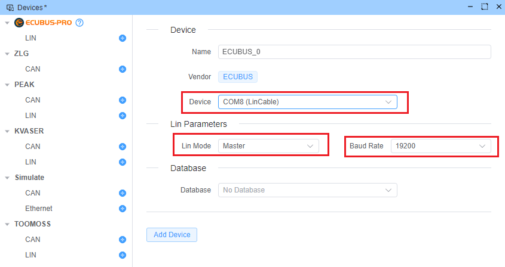
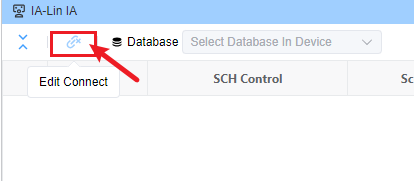
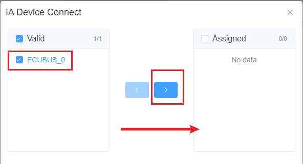
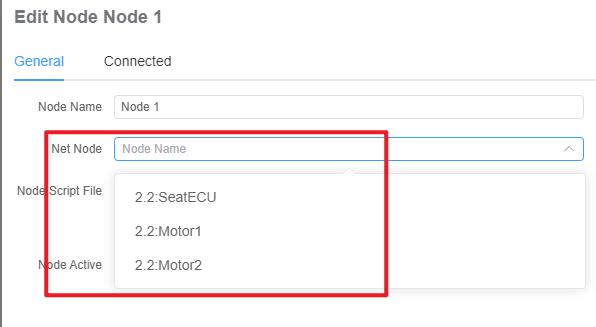

# LIN

LIN 是一种经济高效且确定性的通信协议，专为连接电子控制单元 (ECU) 与智能传感器、执行器和控制器而设计。EcuBus-Pro 的 LIN 模块提供了全面的功能，用于按照 LIN 2.x 规范开发、分析和测试 LIN 网络。

## 添加设备

通过顶部的菜单栏，选择`Hardware`，然后在有LIN的设备右边点击`+`添加设备。

 

支持的硬件：
| 制造商 | 协议 | 功能 |
|--------|-------------------| -- |
| `EcuBus LinCable` | LIN | 支持错误注入，可以做一致性测试，同时支持PWM输出 | 
| PEAK | LIN | |
| KVASER | LIN | |
| Toomoss | LIN| 支持 12v 电压输出/输入，5v 电压输出   |
| VECTOR | LIN | |
 

## 配置设备

点击添加设备后,会要求输入设备：
1. 设备自定义名称
2. Device通过
3. 工作模式，Master还是Slave
4. 波特率
5. 绑定的数据库 (可选的)

> [!IMPORTANT]
> 后续描述的一些功能可能需要导入 LIN 数据库文件 (LDF)。有关 LDF 的更多信息，请参阅[数据库文档](./../ldf)。

## 调度表管理

> [!IMPORTANT]
> 当LIN工作在Master节点的时候可用。
> 需要对应的设备加载对应的数据库。

调度表管控可用周期性的执行LDF数据库里的某一个调度表。

### 添加LIN交互器
   - 打开Network界面
   - 在Network左侧的`Lin`网络下的`Interaction`标签下点击`+`添加交互器
     

### 打开LIN交互器
  - 打开交互器配置
    
  - 配置交互器连接的LIN设备
    
  - 选择想要连接的LIN设备
    
  - 查看和管理现有调度表，可用通过关闭Active来临时跳过某个调度表里的某个帧。
     

## 节点仿真和信号编辑

> [!IMPORTANT]
> 需要对应的设备加载对应的数据库。

配置和仿真 LIN 节点以测试网络行为，动态更新对应节点的信号值。

### 节点配置步骤

1. **添加Node**
   - 打开Network界面
   - 在Network左侧的`Node`标签下点击`+`添加节点
     

2. **配置Node**
   - 打开Node配置
     
   - 设置Node连接的设备
     
   - 选择Node模拟的网络节点 (**需要选择对应的LIN设备,且对应的设备有绑定数据库**)
     

3. **信号值编辑器**
   - 当Node配置好后，可以编辑已配置Node的信号值
     
   - 修改信号值 （**只能修改由已配置Node发布（Publish）的信号，比如下图，只能修改`Motor2`的作为发布者的信号值**)
     

4. **节点模拟**
   当Node配置了网络节点后，会自动模拟Node发送信号。
   比如，当设备Lin工作为Master模式，Node1配置为`Motor2`Slave网络节点，那么当收到`Motor2`的请求时，Node1会自动响应这一帧，给出Response。
