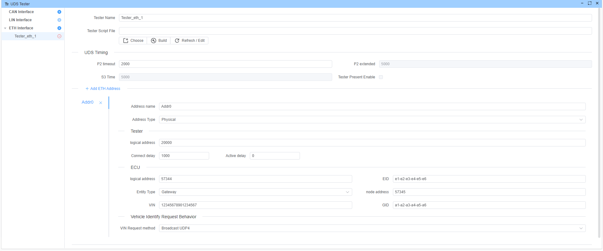

# DoIP Example

This example demonstrates how to use the DOIP protocol to communicate with the ECU. `EcuBus-Pro` acts as the tester, while `doip-custom-simulation` functions as the entity (Gateway).

## EcuBus-Pro Setup

### Device

Use loopback channel


### Tester

Address information get from `doip-custom-simulation` gateway.properties file

- Tester addr:20000
- Gateway addr:57344
- Ecu addr:57345



## `doip-custom-simulation` Setup

`doip-custom-simulation` is a custom simulation for the DOIP protocol, functioning as an entity. For more detailed information, visit the [doip-custom-simulation GitHub repository](https://github.com/doip/doip-custom-simulation).

### Install

```bash
git clone https://github.com/doip/doip-custom-simulation.git
```

### Build

```
cd doip-custom-simulation

.\gradlew.bat build
```

> [!TIP]
> Using aliyun mirror if you download gradle too slow,
> edit gradle/wrapper/gradle-wrapper.properties file
> update `distributionUrl` to `https\://mirrors.aliyun.com/macports/distfiles/gradle//gradle-8.1.1-bin.zip`


### Generate dist

```
.\gradlew.bat installDist
```

### Run

\*.properties file is the configuration file, you can modify it to change the configuration.

```
cd build\install\doip-custom-simulation

java "-Dlog4j.configurationFile=log4j2.xml" -jar libs/doip-custom-simulation-2.0.0.jar gateway.properties
```

log from doip-custom-simulation:

```bash
10:55:24.574 [GW:TCP-RECV-1]  TRACE  doip.simulation.standard.StandardGateway         - >>> public void onConnectionClosed(DoipTcpConnection doipTcpConnection)
10:55:24.574 [GW:TCP-RECV-1]  TRACE  doip.library.comm.DoipTcpConnection              - >>> void removeListener(DoipTcpConnectionListener listener)
10:55:24.574 [GW:TCP-RECV-1]  TRACE  doip.library.comm.DoipTcpConnection              - <<< void removeListener(DoipTcpConnectionListener listener)
10:55:24.574 [GW:TCP-RECV-1]  TRACE  doip.simulation.standard.StandardGateway         - <<< public void onConnectionClosed(DoipTcpConnection doipTcpConnection)
10:55:24.575 [GW:TCP-RECV-1]  TRACE  doip.library.comm.DoipTcpConnection              - <<< public void onSocketClosed()
10:55:24.575 [GW:TCP-RECV-1]  TRACE  doip.library.net.TcpReceiver                     - <<< public void onSocketClosed()
10:55:24.575 [GW:TCP-RECV-1]  TRACE  doip.library.net.TcpReceiverThread               - <<< void run()
10:59:23.777 [Thread-3    ]  INFO   doip.simulation.standard.StandardTcpConnectionGateway - Connection will be closed due to general inactivity timer expired. General inactivity time was 300000 ms.
10:59:23.778 [Thread-3    ]  TRACE  doip.library.comm.DoipTcpConnection              - >>> public void stop()
10:59:23.779 [Thread-3    ]  TRACE  doip.library.net.TcpReceiverThread               - >>> void stop()
10:59:23.779 [Thread-3    ]  DEBUG  doip.library.net.TcpReceiverThread               - Close socket
10:59:23.779 [Thread-3    ]  TRACE  doip.library.net.TcpReceiverThread               - <<< void stop()
10:59:23.791 [Thread-3    ]  TRACE  doip.library.net.TcpReceiver                     - >>> void removeListener(TcpReceiverListener listener)
10:59:23.792 [Thread-3    ]  TRACE  doip.library.net.TcpReceiver                     - <<< void removeListener(TcpReceiverListener listener)
10:59:23.792 [Thread-3    ]  TRACE  doip.library.comm.DoipTcpConnection              - <<< public void stop()
```

## Execution

Start the sequence and open the trace window to view all frames. Alternatively, use Wireshark to capture these frames.

