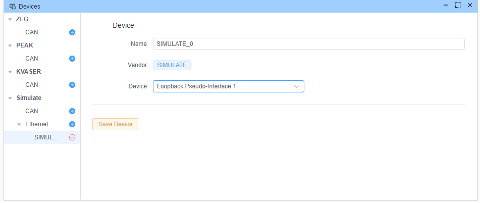
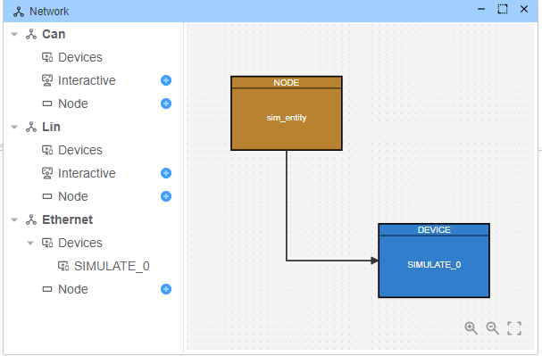
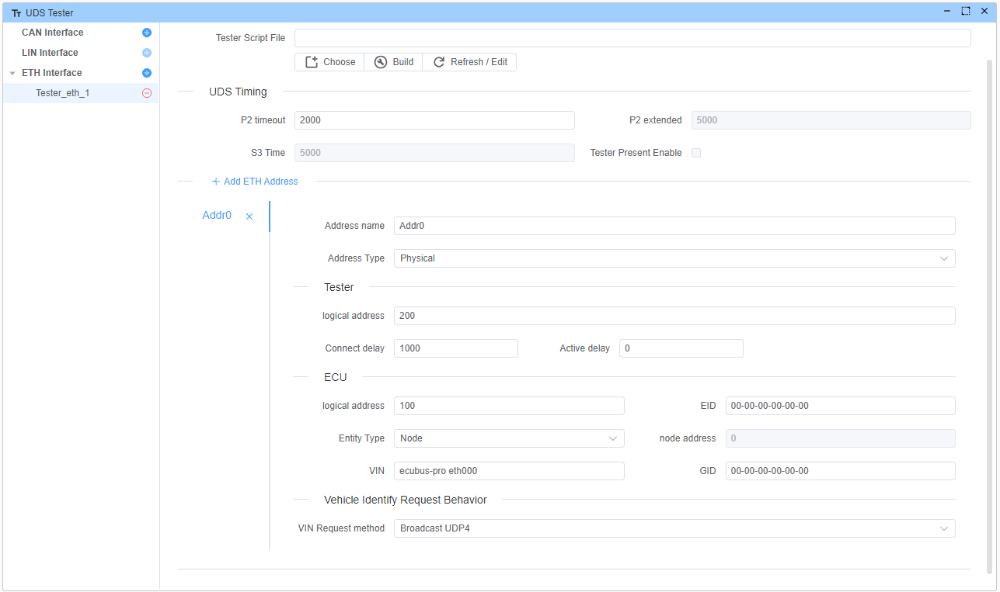

# DoIP Simulate Entity Example

This example demonstrates how to use the DOIP protocol to communicate with the ECU. Use script to simulate an entity and send UDS Response frame to the tester.

## Device

Use loopback channel


## Node

Add a node item and attach the script(`node.ts`)



```typescript
import {DiagResponse, RegisterEthVirtualEntity} from 'ECB'


UDS.Init(async () => {
    console.log('Registering virtual entity')
    await RegisterEthVirtualEntity('127.0.0.1',{
        vin:'123456789',
        eid:'00-00-00-00-00-00',
        gid:'00-00-00-00-00-00',
        logicalAddr:100
    })
})

UDS.On("Tester_eth_1.DiagnosticSessionControl160.send",async (req)=>{
    const resp=DiagResponse.fromDiagRequest(req)
    await resp.outputDiag()
})
```

## Tester

Address information need same as your register entity

* Tester addr:200
* Gateway addr:100



## Execution

Start the sequence and open the trace window to view all frames. Alternatively, use Wireshark to capture these frames.

