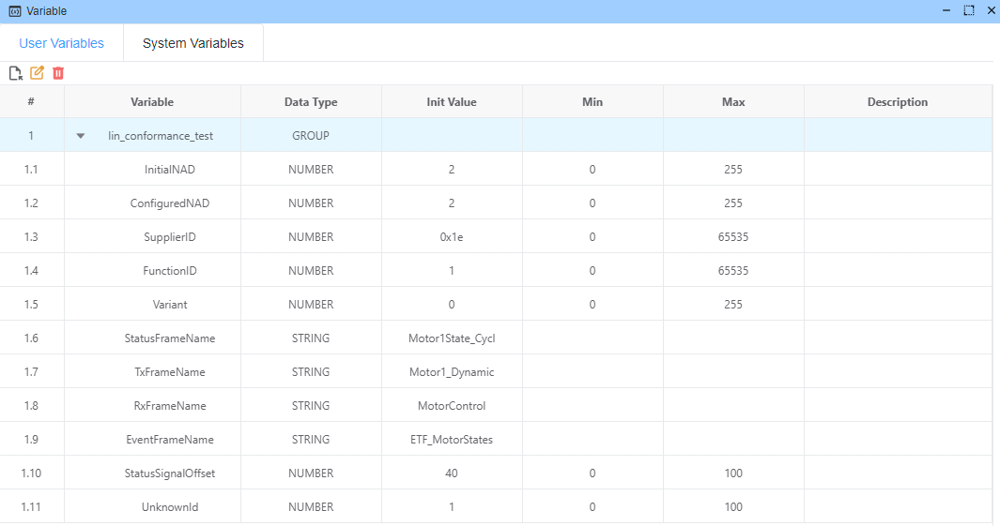
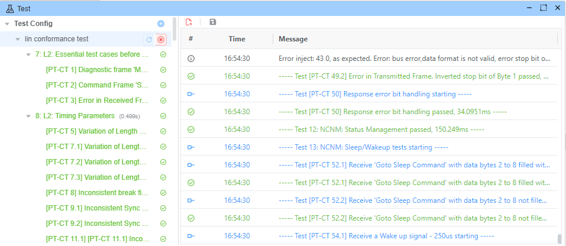

# LIN Conformance Test Example

This example demonstrates comprehensive LIN conformance testing using EcuBus-Pro and LinCable, following the ISO/DIS 17987-6 standard. The test suite validates LIN protocol compliance, timing parameters, and error handling capabilities through advanced fault injection techniques.

## Overview

The LIN conformance test example provides a complete testing framework for validating LIN network components according to automotive industry standards. It leverages LinCable's advanced fault injection capabilities to simulate various error conditions and verify proper error handling in LIN slave nodes.

You can modify the test script to implement your own additional test requirements.

## Used Devices

- **[EcuBus-LinCable](https://app.whyengineer.com/docs/um/hardware/lincable.html)**: USB-to-LIN adapter with advanced fault injection capabilities (required for error injection testing)

> [!NOTE]
> Fault injection testing requires EcuBus-LinCable as it is the only device capable of performing error injection operations. Standard LIN adapters cannot perform these advanced testing functions.

## Test Database

Conformance testing relies on the LIN Description File (LDF). The LDF defines the LIN network topology, node information, signal definitions, and more.

The test database is in the [LINdb.ldf](https://github.com/ecubus-pro/ecubus-pro/blob/main/resources/examples/lin_conformance_test/LINdb.ldf) file.

## User Variables

Although we already have a database, we also define additional user variables to facilitate automated testing.

| Variable | Type | Default | Range | Description |
|---|---|---|---|---|
| InitialNAD | number | 2 | 0–255 | Initial Node Address before configuration; used for diagnostics addressing and pre-configuration communication. |
| ConfiguredNAD | number | 2 | 0–255 | Node Address after configuration; used to validate that configuration and subsequent communication use the expected address. |
| SupplierID | number | 0x1e | 0–65535 | Supplier identifier, used in identity/consistency checks such as identifier reads. |
| FunctionID | number | 1 | 0–65535 | Function identifier for tests related to node identity/function consistency. |
| Variant | number | 0 | 0–255 | Variant number to differentiate firmware/config variants in test scenarios. |
| StatusFrameName | string | "Motor1State_Cycl" | - | Status frame name for periodically reading slave node status, corresponding to the LDF. |
| TxFrameName | string | "Motor1_Dynamic" | - | Master transmit frame name used to send dynamic data/commands to slaves. |
| RxFrameName | string | "MotorControl" | - | Frame name used for master control and readback coordination. |
| EventFrameName | string | "ETF_MotorStates" | - | Event-triggered frame name for event and collision-resolution related tests. |
| StatusSignalOffset | number | 40 | 0–100 | Bit offset of the status field within the status frame (e.g., for locating `response_error`). |
| UnknownId | number | 1 | 0–100 | Parameter for invalid/unknown ID testing to validate error handling for abnormal frame IDs. |

## Test Script

The test script is in the [test.ts](https://github.com/ecubus-pro/ecubus-pro/blob/main/resources/examples/lin_conformance_test/test.ts) file.

## Test Report

Exported test report:

