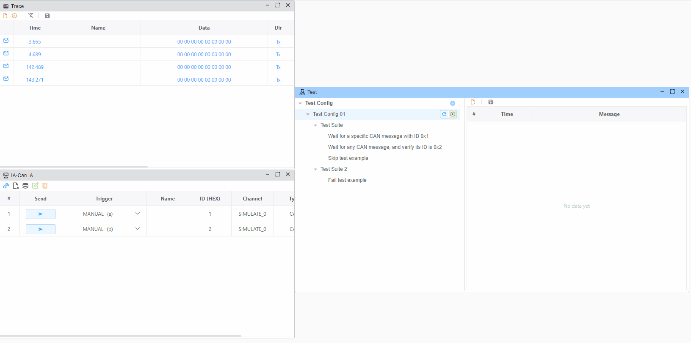
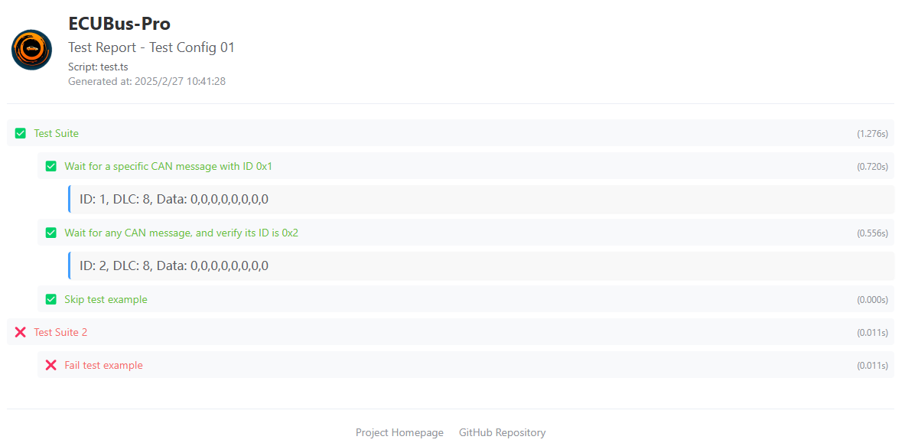
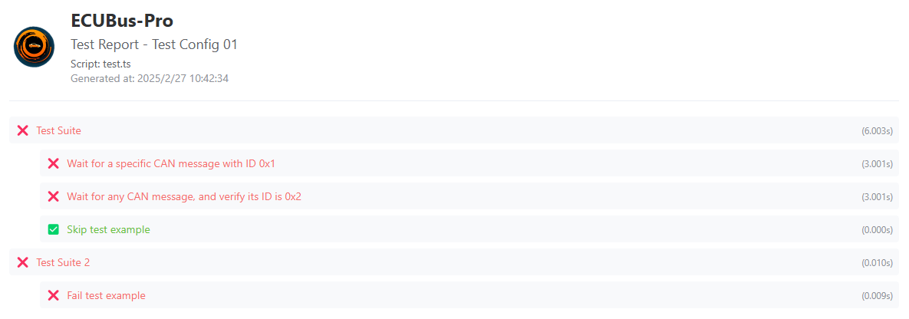

# Test Simple

About test framework, see UM [Test](../../../docs/um/test/test.md)
- Interface: `CAN`
- Vendor Device: `Simulate`
- Test Script: test.ts
```typescript
import { describe, test, assert, CanMessage, DiagResponse, DiagRequest } from 'ECB'

/**
 * Utility function to wait for a specific CAN message
 * @param id - The CAN message ID to wait for, or true to accept any message
 * @param timeout - Maximum time to wait in milliseconds (defaults to 1000ms)
 * @returns Promise that resolves with the received CAN message
 */
const TestWaitForMessage = async (id: number | true, timeout: number = 1000) => {
  return new Promise<CanMessage>((resolve, reject) => {
    // Set timeout to reject the promise if no message is received
    const timer = setTimeout(() => {
      reject(new Error('timeout'))
    }, timeout)
    // Register one-time handler for the specified CAN message ID
    Util.OnCanOnce(id, (msg) => {
      clearTimeout(timer)
      console.log(
        `ID: ${msg.id}, DLC: ${msg.data.length}, Data: ${msg.data.toString('hex').toUpperCase()}`
      )
      resolve(msg)
    })
  })
}

/**
 * Utility function to wait for UDS response message
 * @param timeout - Maximum time to wait in milliseconds (defaults to 1000ms)
 * @returns Promise that resolves with the received DiagResponse
 */
const TestWaitForUDSRespMessage = async (timeout: number = 1000) => {
  return new Promise<DiagResponse>((resolve, reject) => {
    // Set timeout to reject the promise if no message is received
    const timer = setTimeout(() => {
      reject(new Error('timeout'))
    }, timeout)
    // Register one-time handler for the specified CAN message ID
    Util.OnOnce('Tester_can_0.*.recv', (msg) => {
      clearTimeout(timer)
      console.log(`Receive UDS Message: ${msg.diagGetRaw().toString('hex').toUpperCase()}`)
      resolve(msg)
    })
  })
}

// CAN test suite
describe('CAN Test', () => {
  test('Wait for a specific CAN message with ID 0x1', async () => {
    await TestWaitForMessage(0x1, 3000)
    assert(true)
  })

  // Test case that waits for any CAN message and verifies its ID is 0x2
  test('Wait for any CAN message, and verify its ID is 0x2', async () => {
    const msg = await TestWaitForMessage(true, 3000)
    assert(msg.id == 0x2)
  })

  // Skipped test case that would otherwise pass immediately
  test.skip('Skip test example', async () => {
    assert(true)
  })
})

// UDS test suite
describe('UDS Test', () => {
  // UDS diagnostic test case
  test('DiagnosticSessionControl160 test', async () => {
    const diagReq = DiagRequest.from('Tester_can_0.DiagnosticSessionControl160')
    await diagReq.outputDiag()
    console.log('DiagnosticSessionControl160 send out')
    const msg = await TestWaitForUDSRespMessage(3000)
    //compare with hoped
    const recvData = msg.diagGetRaw()
    const hoped = Buffer.from([0x50, 0x01, 0x0])
    assert(recvData.equals(hoped))
  })
})
```
- CAN-IA
  - ID (1), press a to send
  - ID (2), press b to send


## Test Features
This test example demonstrates:
1. **CAN Message Testing**: Wait for specific CAN messages and verify their properties
2. **UDS Diagnostic Testing**: Send UDS diagnostic requests and validate responses
3. **Test Utilities**: Reusable functions for message handling with timeout support

## Example Success
For CAN tests:
- Press 'a' in `Wait for a specific CAN message with ID 0x1`
- Press 'b' in `Wait for any CAN message, and verify its ID is 0x2`

For UDS tests:
- The DiagnosticSessionControl160 test will automatically send the diagnostic request and wait for the expected response




## Example Fail
Don't press any key, will timeout in `Wait can frame`

