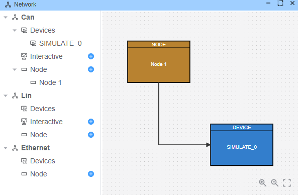

# UDS Hex File Programming Example

This example demonstrates how to program a hex file into an ECU using UDS (Unified Diagnostic Services) protocol. The project shows how to use `HexMemoryMap` to parse a hex file and program it into an ECU using block transfer.


## Overview

The example implements a programming sequence using the following UDS services:
- RequestDownload (0x34)
- TransferData (0x36)
- RequestTransferExit (0x37)

## Tester Config
### Tester (tester.ts)

### Service

* 0x34
* 0x36
* 0x37


### Sequence


## `tester.ts` Implementation Details 

### HexMemoryMap Usage

The project uses `HexMemoryMap` to parse an Intel HEX file:
```typescript
const hexFile = path.join(process.env.PROJECT_ROOT, 'Hello_World.hex')
const hexStr = await fsP.readFile(hexFile, 'utf8')
const map = HexMemoryMap.fromHex(hexStr)
// Convert hex data into memory blocks
for(const [addr, data] of map) {
pendingBlocks.push({addr, data})
}
```
More details about `HexMemoryMap` can be found in the [API documentation](https://app.whyengineer.com/scriptApi/scriptApi/classes/HexMemoryMap.html).

### Programming Flow

The programming process is divided into two main job functions:

#### Job Function 0 (Initial Request)
- Reads the next memory block to be programmed
- Sends RequestDownload (0x34) service with memory address and size
- Gets maximum block size from ECU response
```typescript
const r34 = DiagRequest.from("Tester.RequestDownload520")
const memoryAddress = Buffer.alloc(4)
memoryAddress.writeUInt32BE(currentBlock.addr)
r34.diagSetParameterRaw('memoryAddress', memoryAddress)
r34.diagSetParameter('memorySize', currentBlock.data.length)

```


#### Job Function 1 (Data Transfer)
- Splits data into chunks based on maxChunkSize
- Sends TransferData (0x36) for each chunk
- Sends RequestTransferExit (0x37) after all chunks
- Restarts process if more blocks exist

### Key Features

1. **Dynamic Block Size Adjustment**
   - Adjusts block size based on ECU capabilities
   - Aligns to 8-byte boundaries for optimal transfer
   ```typescript
   maxChunkSize -= 2 // Account for block sequence counter
   if (maxChunkSize & 0x07) {
       maxChunkSize -= (maxChunkSize & 0x07)
   }
   ```

2. **Block Sequence Counter**
   - Implements 1-255 rolling counter for block tracking
   ```typescript
   const blockSequenceCounter = Buffer.alloc(1)
   blockSequenceCounter.writeUInt8((i + 1) & 0xFF)
   ```

3. **Automatic Block Management**
   - Queues multiple memory blocks
   - Handles transitions between blocks automatically
   - Restarts programming sequence for each block

## Flow Diagram

```mermaid

sequenceDiagram
participant Tester
participant ECU
Note over Tester: Job Function 0
Tester->>ECU: RequestDownload (0x34)
ECU-->>Tester: Positive Response + maxBlockSize
Note over Tester: Job Function 1
loop For each chunk
Tester->>ECU: TransferData (0x36) + BlockSequence
ECU-->>Tester: Positive Response
end
Tester->>ECU: RequestTransferExit (0x37)
ECU-->>Tester: Positive Response
alt More Blocks Exist
Note over Tester: Restart with Job Function 0 Job Function 1
else No More Blocks
Note over Tester: Programming Complete
end

```

## ECU Simulation

`Node 1(ecu.ts)` simulation that responds to the programming requests. The ECU side handles three main services:

### 1. RequestDownload (0x34) Response
```typescript
Util.On('Tester.RequestDownload520.send', async (req) => {
    const resp = DiagResponse.fromDiagRequest(req)
    // Response: 0x74 (positive response)
    // 0x40: length format identifier
    // 0x00000081: maxNumberOfBlockLength (129 bytes)
    resp.diagSetRaw(Buffer.from([0x74, 0x40, 0, 0, 0, 0x81]))
    await resp.outputDiag()
})
```
- Responds with positive response (0x74)
- Specifies maximum block length (129 bytes)
- Uses length format identifier 0x40

### 2. TransferData (0x36) Response
```typescript
Util.On('Tester.TransferData540.send', async (req) => {
    const resp = DiagResponse.fromDiagRequest(req)
    // Response: 0x76 (positive response) + block sequence counter
    resp.diagSetRaw(Buffer.from([0x76, Number(req.diagGetParameter('blockSequenceCounter'))]))
    await resp.outputDiag()
})
```
- Acknowledges each data block with positive response (0x76)
- Echoes back the block sequence counter
- Simulates successful data transfer

### 3. RequestTransferExit (0x37) Response
```typescript
Util.On('Tester.RequestTransferExit550.send', async (req) => {
    const resp = DiagResponse.fromDiagRequest(req)
    // Response: 0x77 (positive response)
    resp.diagSetRaw(Buffer.from([0x77]))
    await resp.outputDiag()
})
```
- Confirms completion of transfer with positive response (0x77)
- Simulates successful programming completion

The ECU simulation provides a complete test environment for the programming sequence, allowing developers to test their programming implementation without actual hardware.

## Demo
