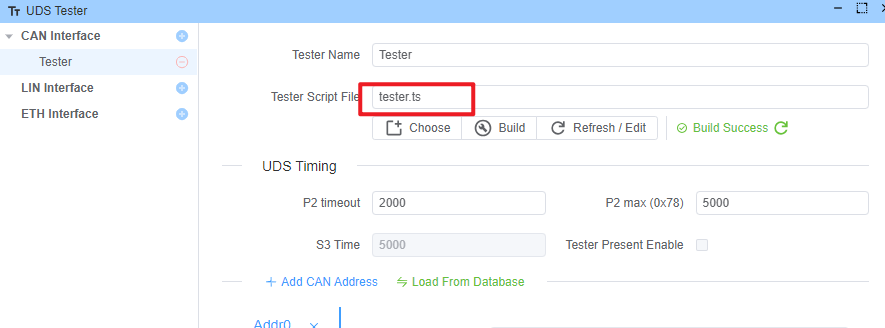
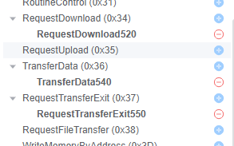

# UDS File Programming Example

This example demonstrates how to program hex and S-record files into an ECU using UDS (Unified Diagnostic Services) protocol. The project shows how to use `HexMemoryMap` and `S19MemoryMap` to parse Intel HEX and Motorola S-record files and program them into an ECU using block transfer.

## Overview

The example implements a programming sequence using the following UDS services:

- RequestDownload (0x34)
- TransferData (0x36)
- RequestTransferExit (0x37)

## Tester Config

### Tester (tester.ts)



### Service

- 0x34
- 0x36
- 0x37



### Sequence


## `tester.ts` Implementation Details

### File Format Support

The project supports both Intel HEX and Motorola S-record formats using `HexMemoryMap` and `S19MemoryMap`:

#### Intel HEX Files (.hex)

```typescript
const hexFile = path.join(process.env.PROJECT_ROOT, 'Hello_World.hex')
const hexStr = await fsP.readFile(hexFile, 'utf8')
const map = HexMemoryMap.fromHex(hexStr)
// Convert hex data into memory blocks
for (const [addr, data] of map) {
  pendingBlocks.push({ addr, data })
}
```

#### Motorola S-record Files (.s19, .srec)

```typescript
const s19File = path.join(process.env.PROJECT_ROOT, 'Hello_World.s19')
const s19Str = await fsP.readFile(s19File, 'utf8')
const map = S19MemoryMap.fromS19(s19Str)
// Convert S-record data into memory blocks
for (const [addr, data] of map) {
  pendingBlocks.push({ addr, data })
}
```

#### Auto-Detection Example

```typescript
const filePath = process.env.FIRMWARE_FILE // Could be .hex or .s19
const fileContent = await fsP.readFile(filePath, 'utf8')
const fileExt = path.extname(filePath).toLowerCase()

let map
if (fileExt === '.hex') {
  map = HexMemoryMap.fromHex(fileContent)
} else if (fileExt === '.s19' || fileExt === '.srec') {
  map = S19MemoryMap.fromS19(fileContent)
} else {
  throw new Error(`Unsupported file format: ${fileExt}`)
}

// Both formats use the same interface
for (const [addr, data] of map) {
  pendingBlocks.push({ addr, data })
}
```

#### Supported File Formats

| Format | File Extensions | Record Types | Address Range |
|--------|----------------|--------------|---------------|
| Intel HEX | `.hex` | :00-:05 | 16-bit with extensions |
| Motorola S-record | `.s19`, `.srec`, `.s28`, `.s37` | S0-S9 | 16-bit (S1), 24-bit (S2), 32-bit (S3) |

Both `HexMemoryMap` and `S19MemoryMap` provide identical interfaces, making it easy to switch between formats or support both in the same application.

More details can be found in the API documentation:
- [HexMemoryMap](https://app.whyengineer.com/scriptApi/scriptApi/classes/HexMemoryMap.html)
- [S19MemoryMap](https://app.whyengineer.com/scriptApi/scriptApi/classes/S19MemoryMap.html)

### Programming Flow

The programming process is divided into two main job functions:

#### Job Function 0 (Initial Request)

- Reads the next memory block to be programmed
- Sends RequestDownload (0x34) service with memory address and size
- Gets maximum block size from ECU response

```typescript
const r34 = DiagRequest.from('Tester.RequestDownload520')
const memoryAddress = Buffer.alloc(4)
memoryAddress.writeUInt32BE(currentBlock.addr)
r34.diagSetParameterRaw('memoryAddress', memoryAddress)
r34.diagSetParameter('memorySize', currentBlock.data.length)
```

#### Job Function 1 (Data Transfer)

- Splits data into chunks based on maxChunkSize
- Sends TransferData (0x36) for each chunk
- Sends RequestTransferExit (0x37) after all chunks
- Restarts process if more blocks exist

### Key Features

1. **Multi-Format Support**

   - Intel HEX format support (:00-:05 records)
   - Motorola S-record format support (S0-S9 records with S1/S2/S3 data)
   - Unified interface for both formats
   - Automatic format detection based on file extension

2. **Dynamic Block Size Adjustment**

   - Adjusts block size based on ECU capabilities
   - Aligns to 8-byte boundaries for optimal transfer

   ```typescript
   maxChunkSize -= 2 // Account for block sequence counter
   if (maxChunkSize & 0x07) {
     maxChunkSize -= maxChunkSize & 0x07
   }
   ```

3. **Block Sequence Counter**

   - Implements 1-255 rolling counter for block tracking

   ```typescript
   const blockSequenceCounter = Buffer.alloc(1)
   blockSequenceCounter.writeUInt8((i + 1) & 0xff)
   ```

4. **Automatic Block Management**
   - Queues multiple memory blocks
   - Handles transitions between blocks automatically
   - Restarts programming sequence for each block
   - Works seamlessly with both HEX and S-record formats

## Flow Diagram

```mermaid

sequenceDiagram
participant Tester
participant ECU
Note over Tester: Job Function 0
Tester->>ECU: RequestDownload (0x34)
ECU-->>Tester: Positive Response + maxBlockSize
Note over Tester: Job Function 1
loop For each chunk
Tester->>ECU: TransferData (0x36) + BlockSequence
ECU-->>Tester: Positive Response
end
Tester->>ECU: RequestTransferExit (0x37)
ECU-->>Tester: Positive Response
alt More Blocks Exist
Note over Tester: Restart with Job Function 0 Job Function 1
else No More Blocks
Note over Tester: Programming Complete
end

```

## ECU Simulation

`Node 1(ecu.ts)` simulation that responds to the programming requests. The ECU side handles three main services:


### 1. RequestDownload (0x34) Response

```typescript
Util.On('Tester.RequestDownload520.send', async (req) => {
  const resp = DiagResponse.fromDiagRequest(req)
  // Response: 0x74 (positive response)
  // 0x40: length format identifier
  // 0x00000081: maxNumberOfBlockLength (129 bytes)
  resp.diagSetRaw(Buffer.from([0x74, 0x40, 0, 0, 0, 0x81]))
  await resp.outputDiag()
})
```

- Responds with positive response (0x74)
- Specifies maximum block length (129 bytes)
- Uses length format identifier 0x40

### 2. TransferData (0x36) Response

```typescript
Util.On('Tester.TransferData540.send', async (req) => {
  const resp = DiagResponse.fromDiagRequest(req)
  // Response: 0x76 (positive response) + block sequence counter
  resp.diagSetRaw(Buffer.from([0x76, Number(req.diagGetParameter('blockSequenceCounter'))]))
  await resp.outputDiag()
})
```

- Acknowledges each data block with positive response (0x76)
- Echoes back the block sequence counter
- Simulates successful data transfer

### 3. RequestTransferExit (0x37) Response

```typescript
Util.On('Tester.RequestTransferExit550.send', async (req) => {
  const resp = DiagResponse.fromDiagRequest(req)
  // Response: 0x77 (positive response)
  resp.diagSetRaw(Buffer.from([0x77]))
  await resp.outputDiag()
})
```

- Confirms completion of transfer with positive response (0x77)
- Simulates successful programming completion

The ECU simulation provides a complete test environment for the programming sequence, allowing developers to test their programming implementation without actual hardware. The simulation works identically regardless of whether the source file is in Intel HEX or Motorola S-record format.

## Demo


